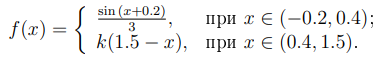
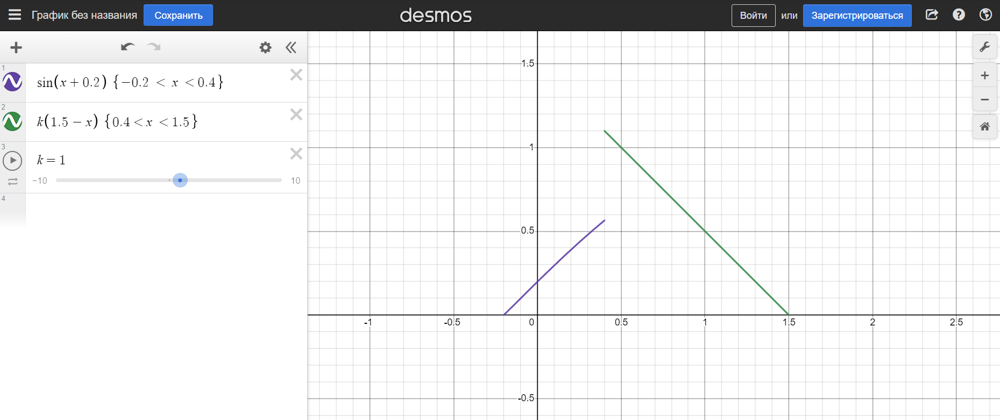

# Моделирование

### Лабораторная работа 2
Задание:
- Написать (запрограммировать) датчик случайных чисел с заданой частотой распределения (при помощи линейных преобразований)
- По сгенерированным данным построить гистограмму частот, чтобы сравнить на соответствие с исходным распределением

Распределение для лабораторной работы №2

График распределения
